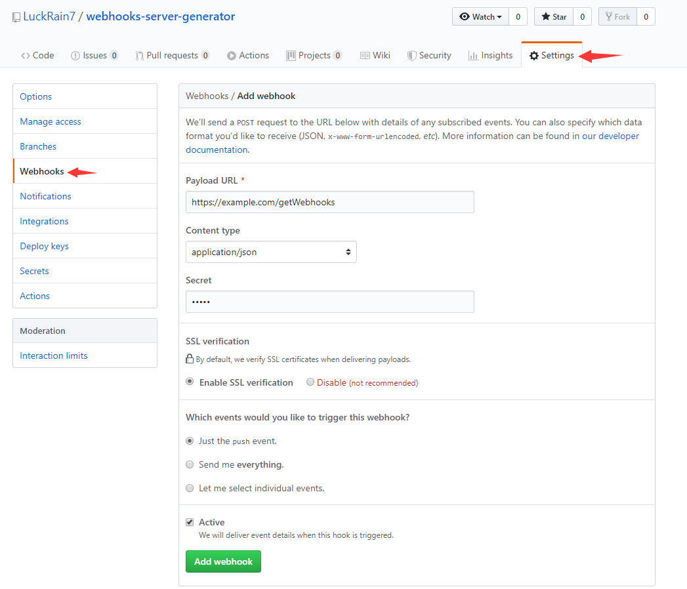

# webhooks-server-generator

> 为你生成 webhooks 服务器端代码，系统基于 Node 运行，你需要具有 Node 环境。
>
> 生成代码同样基于 Node 环境。

#### GitHub在项目中提供Webhooks功能

We’ll send a `POST` request to the URL below with details of any subscribed events. You can also specify which data format you’d like to receive (JSON, `x-www-form-urlencoded`, *etc*). More information can be found in [our developer documentation](https://developer.github.com/webhooks/). 



GitHub 在接受你项目的 push 时，会向你提供的 URL 地址发送一个 POST 请求，利用这一点，在服务器端接受请求并进行验证，实现服务器端的代码自动拉取。


#### 项目使用

> 默认您已经有了 Node 环境


```bash
# 克隆项目
git clone https://github.com/LuckRain7/webhooks-server-generator.git

# 进入项目文件夹
cd webhooks-server-generator

# 安装项目依赖
npm install

# 启动项目
npm run build

# 在浏览器 localhost:3000 端口进行访问

```


#### 生成代码使用

- 新建 webhooks 服务器 

   - 1、根据提示完成操作，输入信息

   - 2、系统会生成对应的压缩包文件（DEMOXX.zip）

   - 3、将压缩包文件上传服务器，在服务器中进行解压

   - 4、进入解压后的文件目录 执行`npm install`

   - 5、项目依赖安装完成后启动服务 `node index.js`

-  添加 webhooks 服务器端代码 

   - 1、根据提示完成操作，输入信息

   - 2、系统会生成需要添加的代码

   - 3、先停掉服务，将代码粘贴到服务器 index.js 文件（`app.listen()`代码上方）

   - 4、重新启动服务器  `node index.js`

